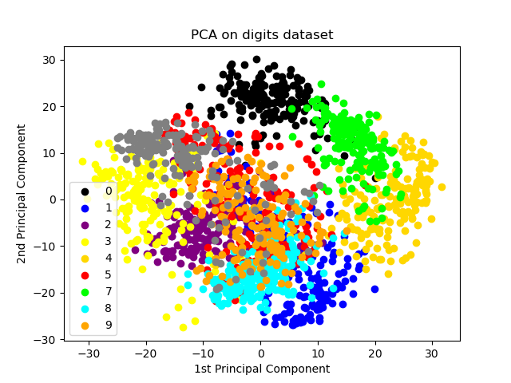

# ES654-2020 Assignment 3

*Jitender* - *Kumar*

## part (a-c)
On digits dataset for K = 4 folds  
Average accuracy  92.98440979955457  
maximum accuracy  96.21380846325167  
two digits get the most confused : 8 and 1  
Easiest digit to predict = 3  
Confusion matrix

## part (d)

Here 10 different classes corresponding to the 10 digits. Digit 0 is most easy to predict as it ver much concentrated in a small region. We see that their instances are clearly grouped in clusters according to their target class. 
